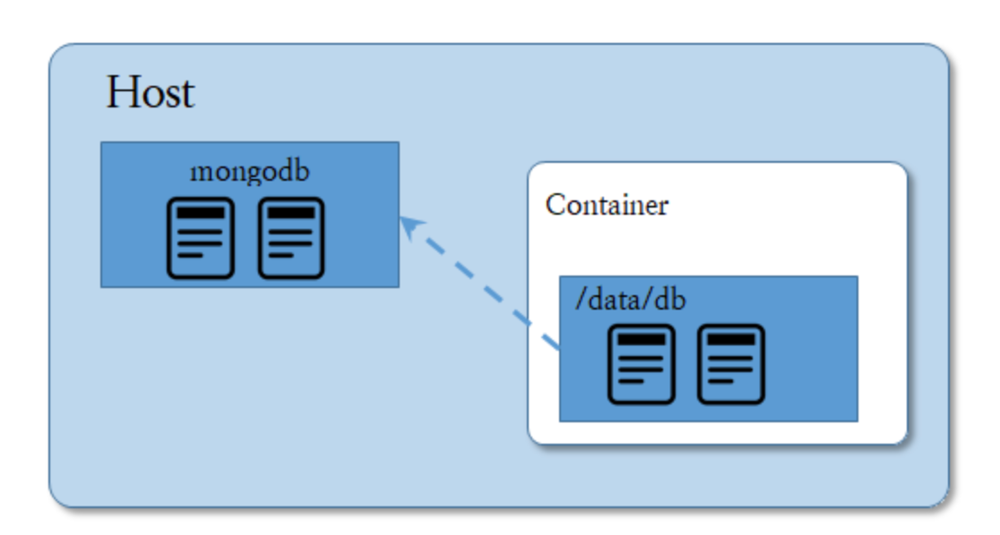
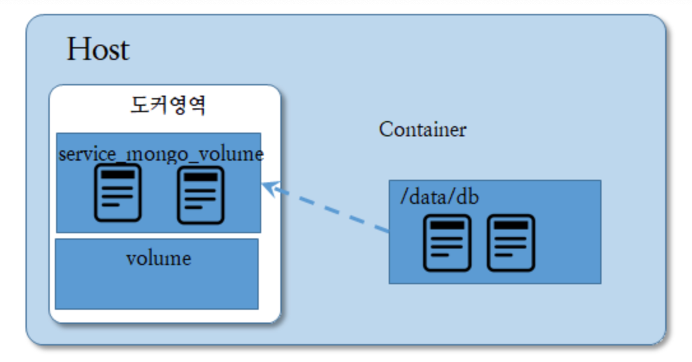

# 장고 백엔드 API 서버 구축에 도커 사용하기 2


> 관련 링크 : [실용주의 프로그래머](https://www.youtube.com/channel/UCmm6VRoi59BUHDPoa3k4VPw/videos)


## gunicorn

이 전에 배포환경에서 python manage.py runserver 명령을 사용한 것이 문제가 되었다. 이 문제 해결을 위해 필요한 것이 `gunicorn`. 

runserver 동작을 gunicorn의 언어로 명령할 수 있다. `gunicorn`은 `NGINX`와 `장고`를 연결하는 인터페이스 역할을 한다. 장고안에서 pip install 명령을 통해 구니콘을 설치하고, 이 덩어리를 이미지로 다시 만든다.

```
이미지 : django_test_image:2
컨테이너 : django_container_gunicorn
```

이 장고-구니콘 덩어리(컨테이너)를 이제 NGINX에 꽂는다. 이 연결하는 방식은 `nginx.conf` 파일을 통해 NGINX 설정을 건드려주는 방식이고, 여기서 정말 다양한 것들을 해볼 수 있다고 한다. (추후 필히 공부 필요) nginx.conf 파일을 작성한다. 컨테이너 이름이 도메인이 되어서 장고 컨테이너와 연결을 시도하는 내용을 `django_container_gunicorn` 담고 있다.

```nginx
worker_processes auto;

events {
}

http {
  server {
    listen 80;

    location / {
        proxy_pass http://django_container_gunicorn:8000;
        proxy_set_header Host $host;
        proxy_set_header X-Forwarded-For $proxy_add_x_forwarded_for;
    }
  }
}
```

외부의 80포트를 듣고 장고컨테이너 8000 포트로 pass한다는 내용이 담겨져있다. 즉, 연결하는 방법의 실질적인 지시는 이 파일에 적게 되는 것이다. 이 적은 파일을 vultr 서버 호스트에 업로드.


## docker 네트워크

도터 네트워크란 도커 호스트 내에서 실행중인 **컨테이너들 간의 논리적인 연결**을 가능하게 하는 도커가 제공하는 서비스이다. 즉, `nginx_django 네트워크`를 만들어서 이 네트워크에 `django_container_gunicorn` 컨테이너와 `nginx` 컨테이너를 쑤셔넣으면 된다. 디테일한 수행은 아래와 같다.

1. `nginx_django` 네트워크 생성

2. `nginx` 컨테이너 생성

   1. 포트 설정 

      host: 80 -> container: 80

   2. 네트워크 설정

      `nginx_django` 선택

   3. Volume 설정 (아래에서 챕터에서 설명)

      container: /etc/nginx/nginx.conf -> host: /home/(설정한 디렉토리명)/nginx.conf

3. `django_gunicorn_container` 컨테이너 생성

   1. 네트워크 설정

      `nginx_django 네트워크` 설정

즉, `django_gunicorn_container`를 만들 때, `nginx_django 네트워크` 설정을 해주고, `nginx_container`를 만들 때, `nginx_django 네트워크` 설정을 또 해주면 되는 셈이다.


## Docker Volume

다른 컨테이너들 간 데이터를 동기화하는 방식으로 공유할 수 있는 기능.





이미지 출처 : https://boying-blog.tistory.com/31

- Bind Volume : 

  - **호스트 시스템의 파일 또는 디렉토리가 도커 영역 안의 컨테이너에 마운트 된다.** 
  - (**도커 외부**) Vultr 서버  /home/(설정한 디렉토리명)/nginx.conf 에 업로드 해둔 nginx.conf 파일과 컨테이너 내의 nginx.conf 파일을 서로 동기화하여 관리

- Named Volume :

  - **도커 영역 내에서 데이터 동기화를 해주는 기능**
  - **도커 내부**에 Volume을 심어서 이 안의 데이터와 서로 다른 컨테이너들에 있는 데이터들을 서로 동기화하여 관리

  

다음은 `MariaDB`에 대한 작업을 해줘야 한다.